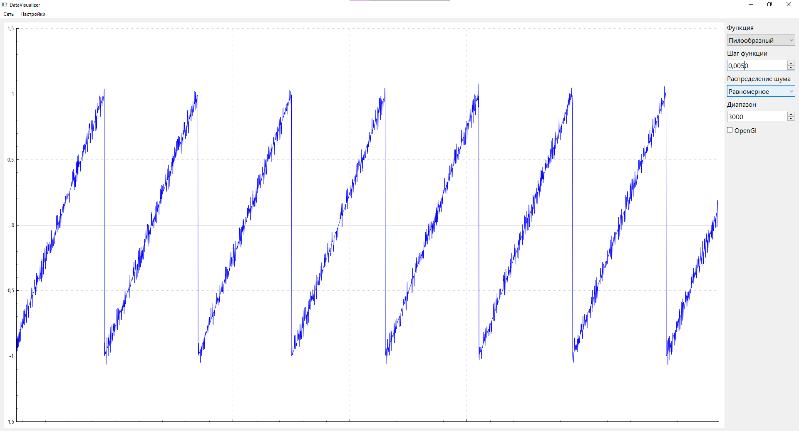
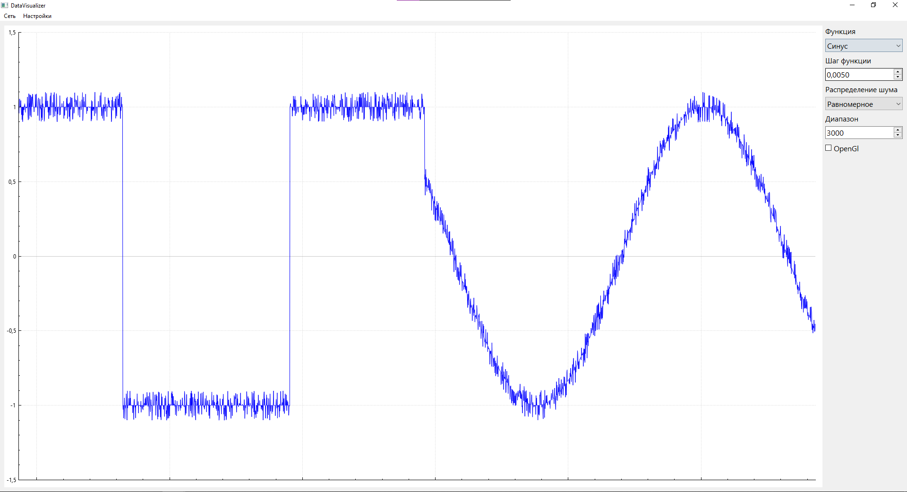
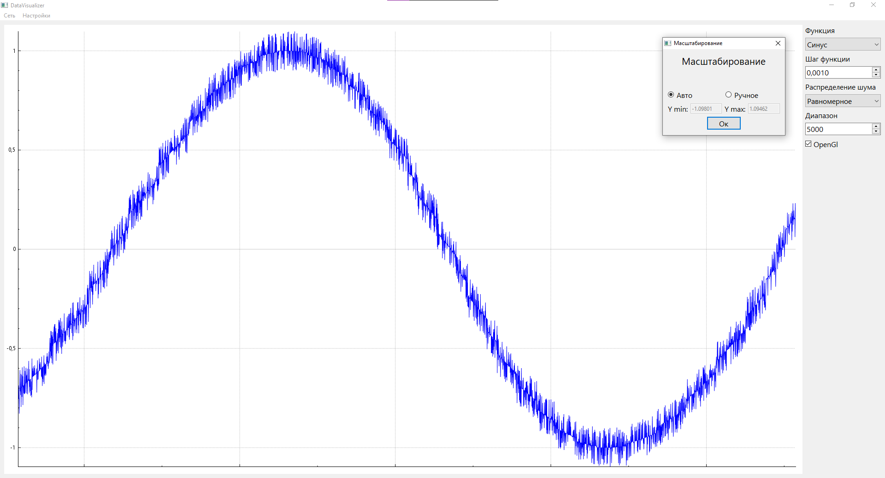
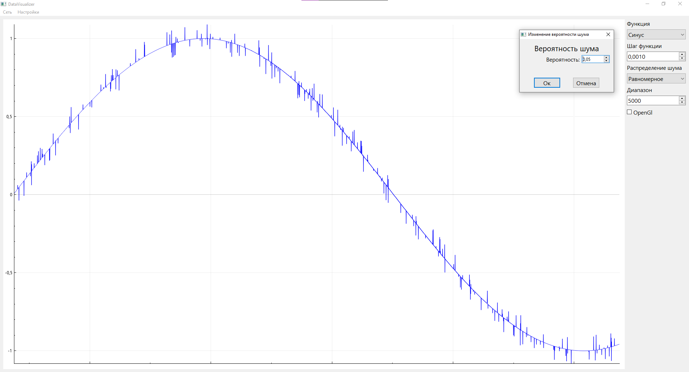

Qt version: 6.2.1 

C++ standart: 11

# Data Visualizer

Project consists of two programs:
- Data Visualizer  
- Data Sender  

## Data Sender
Data Sender is created to send data for visualization to Data Visualizer. It works like a simple server, which sends data to each connected device. When new client sends packet to this server, it creates new thread for this client, sends server's configuration and starts sending data. Every client can setup his thread like he wants separately from other clients (change generation function, noise probability and distribution etc). Disconnection of client performs server accepts quit command or interruption with client wasn't performed during the specified time interval. 

## Data Visualizer
To use Data Visualizer you should choose connect from menu and specify server's address and port. After this done it starts accepting data from server. You can change x-axis scale using *Диапазон* spinbox, and switch y-axis scaling between auto and manual using corresponding action in menu. You can change the port on application running on (after that client would be disconnected from the server and should connect again). You also have an opportunity to change step with which function is evaluated. 

### Server supports following functions:
- Straight line (maybe useful to compare different noise's distributions)
- Random values
- Sinus
- Cosine
- Stepped
- Sawtooth 

### Server supports following noise's distributions:
- None
- Uniform
- Normal

If you wish, you can choose whether or not to use OpenGL acceleration by checking the corresponding checkbox

## Classes overview

### DataVisualizer

- DataReceiver 

    All communication with server occurs through it. Object contains server's address and port to communicate with it. DataReceiver provides methods for changing server's parameters like function, noise distribution etc. When it receives data, it emits dataReceived signal, which is handled in mainwindow.

- MainWindow

    Contains DataReceiver object, performs all communication between other forms, dataReceiver and qcustomplot, which is used for graphics displaying. 

### DataSender

- ConnectionHandler

    It accepts clients requests and gives them out ports, on which their own thread will work. It gives port from range [30000, 40000), if there are no ports available it will just ignore this client. When client disconnects it marks his port as available. 

- DataSender

    It is a main class, which runs in separeted thread for every client. When client connects, DataSender sends its own configuration to client and then starts generating and sending data. After every specified time interval, it checks whether client is still connected or not. If not it emits connectionAborted signal, which is accepted by ConnectionHandler. When ConnectionHandler gets this signal it destroys the DataSender object and marks his port as free. DataSender can read clients commands to change settings like data generating function or client's disconnection.

- DataGenerator

    It is used to generate data using specified function, noise probability and distribution. It should be setup by DataSender.

## Examples

- Graphic of Sawtooth function with uniformly distributed noise with 0.5 noise probability

- Graphic of Discrete function passing to Sinus

- Form for switching between auto and manual y-axis scaling

- Graphic of sinus with 0.05 noise probability 

